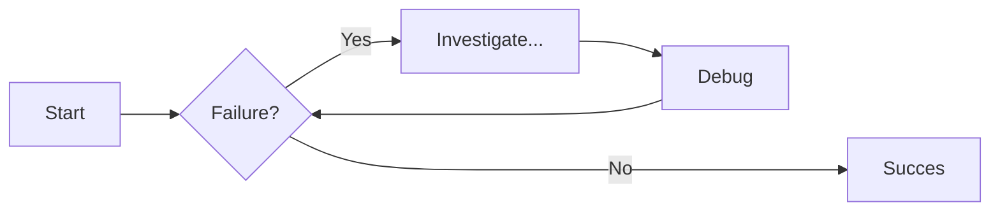

# Памятка по markdown

```js title="js" linenums="1" hl_lines="6-8"
// кусок кода типо
// может указываться конкретный язык
export default defineComponent({
  name: "App",
  async created() {
    if (process.env.DEV) {

    }
  },
});
```

## Табы
=== "Plain text"
    This is some plain text

=== "Unordered list"
    
    * First item
    * Second item
    * Third item

=== "Ordered list"

    1. First item
    2. Second item
    3. Third item

## Admonitions

!!! note "Пример note"
    Improve your resumes with Resume Matcher. Get insights, keyword suggestions and tune your resumes to job descriptions. 

??? info "Пример info collapsed"
    Improve your resumes with Resume Matcher. Get insights, keyword suggestions and tune your resumes to job descriptions. 

## Диаграммы



Более подробнее - [squidfunk.github.io](https://squidfunk.github.io/mkdocs-material/reference/)
